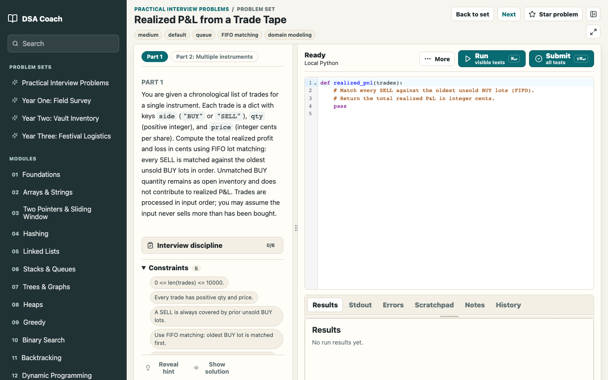

# DSA Coach

DSA Coach is a local-first interview prep course for data structures and algorithms. It is a standalone React app with original lessons, quizzes, Python exercises, and a browser-based runner powered by Pyodide.

The project is designed for self-study: read a lesson, work through guided problems, run Python locally in the browser, review hints and solutions, take quizzes, and export your progress as JSON.



## Features

- 13 course modules covering foundations, arrays, sliding windows, hashing, linked lists, stacks and queues, trees and graphs, heaps, greedy, binary search, backtracking, dynamic programming, and mixed interview review.
- 70 guided original Python problems and 140 runnable bonus drills.
- 12 quizzes with answer explanations.
- Local Python execution through Pyodide in a Web Worker.
- Visible and hidden test cases with separate run and submit flows.
- Problem workspace with prompt, editor, results, stdout, errors, scratchpad, notes, history, hints, solutions, and starred problems.
- IndexedDB persistence for progress, notes, submissions, settings, review state, and workspace preferences.
- JSON export and import for moving local progress between browsers.
- Offline app shell support through a production service worker.
- Content validation and reference-solution verification scripts.

## Quick Start

Install dependencies:

```bash
npm install
```

Run the local dev server:

```bash
npm run dev
```

Then open the URL printed by Vite, usually:

```text
http://127.0.0.1:5173
```

Build for production:

```bash
npm run build
```

Preview the production build:

```bash
npm run preview
```

## Scripts

```bash
npm run dev                # Start Vite locally
npm run build              # Type-check and build
npm run preview            # Serve the production build locally
npm run test               # Run unit tests
npm run test:e2e           # Run Playwright end-to-end tests
npm run test:a11y          # Run Playwright axe accessibility checks
npm run test:pwa           # Run production offline/PWA checks
npm run validate:content   # Validate course and problem metadata
npm run verify:references  # Run reference solutions against tests
```

## Course Content

The course content is original. Public topic coverage can inspire the scope, but the repository does not copy locked or paid LeetCode lesson text, screenshots, quizzes, prompts, solutions, or code templates.

Each chapter lesson includes learning goals, pattern recognition signals, mental models, worked examples, implementation checklists, common mistakes, complexity notes, and links into relevant guided and bonus problems.

Problems include prompts, starter code, visible tests, hidden tests, hints, reference solutions, walkthroughs, complexity notes, and follow-up ideas where useful.

## Local Data

DSA Coach stores user data in browser IndexedDB:

- Lesson, quiz, and problem progress.
- Submissions and run history.
- Notes and scratchpad state.
- Starred problems.
- Workspace settings such as split layout and active tabs.

Use the built-in export/import controls to back up or move progress. There is no account system and no cloud sync.

## Project Structure

```text
src/components/        React screens and course UI
src/content/           Course metadata, lessons, problems, quizzes, solutions
src/runner/            Pyodide worker and result comparison logic
src/storage/           Dexie/IndexedDB persistence
scripts/               Content validation and reference verification
tests/                 Unit, E2E, accessibility, and PWA tests
ui-snapshots/          Reference screenshots
```

## Quality Gates

Before publishing a substantial content or UI change, run:

```bash
npm run validate:content
npm run verify:references
npm run test
npm run build
npm run test:e2e
npm run test:a11y
npm run test:pwa
```

## License

No license has been selected yet. Until one is added, all rights are reserved by the repository owner.
