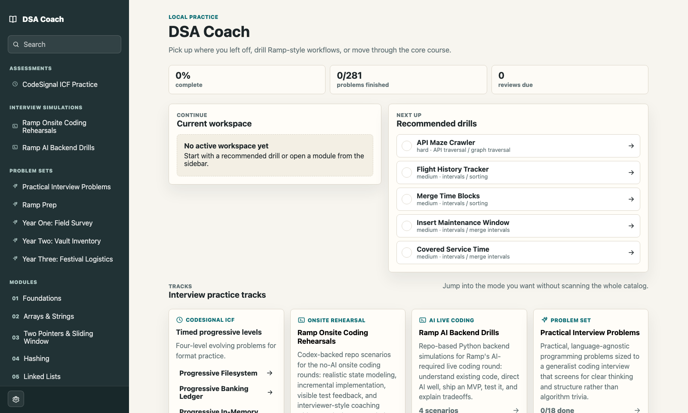
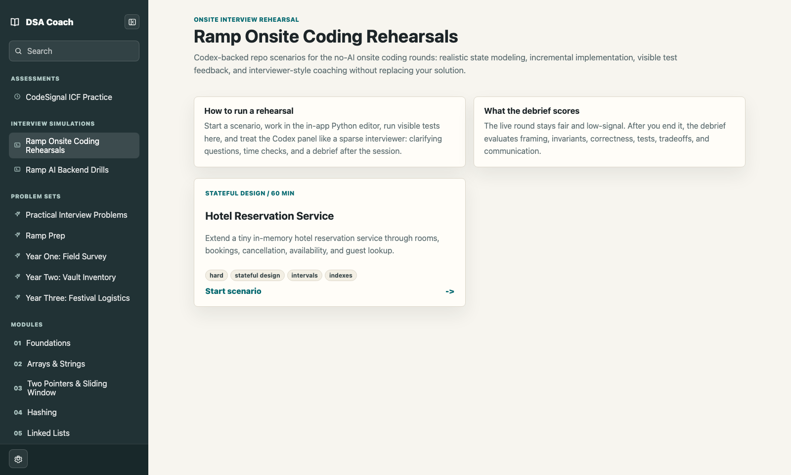
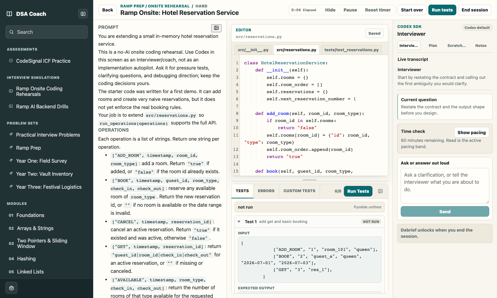
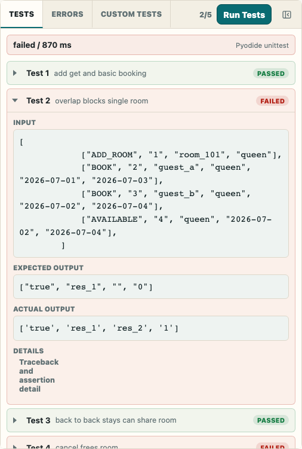
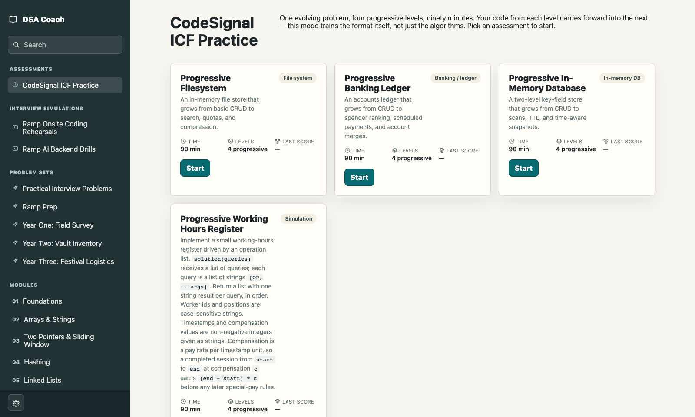

# DSA Coach

DSA Coach is a local-first interview practice app for data structures, practical programming, and coding-interview simulation. The active product is the native macOS app in [`next/`](next/): a React workbench packaged with a local daemon, file-backed practice state, browser-worker Pyodide execution for Python, optional Ollama coaching, and Codex SDK interviewer flows for scenario practice.

The original browser/PWA app still lives at the repository root and remains useful historical context, but new practice-mode work is centered on the native app.



## What To Review

- **Guided practice:** 281 authored problems across modules, problem sets, and interview tracks.
- **In-app Python execution:** Python code runs in a browser worker through Pyodide, including guided problems, CodeSignal-style assessments, scratchpads, visible tests, hidden tests, and Ramp scenario tests.
- **Native practice workflows:** the macOS app packages the web UI and local daemon into a double-clickable app bundle.
- **Ramp Onsite rehearsals:** multi-file Python workspaces with a first-class prompt pane, editor tabs, visible tests, hidden/debrief flow, and a sparse Codex SDK interviewer.
- **CodeSignal ICF practice:** progressive four-level assessments that carry code forward across levels.
- **Optional local AI:** guided-problem coaching can use Ollama locally, and scenario interviews can use the Codex SDK when credentials are configured.









## Native Quick Start

Prerequisites:

- macOS
- [Bun](https://bun.sh/) 1.3.2 or newer
- Xcode Command Line Tools or another Swift toolchain for packaging
- Go and Java if you want the full packaged runtime and non-Python toolchain support
- Optional: [Ollama](https://ollama.com/) for local coaching
- Optional: Codex SDK authentication for scenario interviewer/debrief features

Build, test, and package the native app:

```bash
cd next
bun install
bun run build
bun test
bun run verify:content
bun run package:mac
open -n "dist/macos/DSA Coach Next.app"
```

`bun run package:mac` creates the app bundle at `next/dist/macos/DSA Coach Next.app`. The repository does not commit generated app bundles; attach or zip that bundle separately if you want to share a prebuilt binary with reviewers.

For development, run the daemon and web UI in separate terminals:

```bash
cd next
bun run daemon
```

```bash
cd next
bun run web:dev
```

Open the Vite URL printed by the second command, usually `http://127.0.0.1:5174`.

## Cloudflare Demo

The `next/` app can also be built as a password-protected Cloudflare Pages demo:

```bash
cd next
bun run build:cloud
```

Cloud mode serves the `next` React UI from static assets, runs Python through Pyodide in the browser, stores practice state in that browser, and proxies coach/interviewer model calls through Cloudflare Functions to OpenRouter. See [next/docs/cloudflare-deploy.md](next/docs/cloudflare-deploy.md) for required secrets and deployment steps.

## Optional AI Setup

The guided coach talks to Ollama at `http://127.0.0.1:11434` and expects `gemma4:latest` by default:

```bash
ollama pull gemma4:latest
OLLAMA_ORIGINS="*" ollama serve
```

The scenario interviewer/debrief path uses `@openai/codex-sdk`, which is installed by `bun install` in `next/`. Make sure Codex/OpenAI credentials are available in the shell that starts the daemon or packaged host. You can optionally set the scenario model:

```bash
export DSA_COACH_CODEX_MODEL="your-codex-model"
```

The app still works without Ollama or Codex SDK access; those panes show setup/status guidance instead of blocking the core editor and test workflow.

## Architecture

```text
Native macOS wrapper
  -> local production host
     -> React app
     -> daemon API for content, storage, packaging, coach, and scenario metadata
     -> browser-worker Pyodide for Python practice execution
     -> optional host runners for non-Python language/toolchain work
```

Important directories:

```text
next/apps/web/       Native app React UI and Pyodide workers
next/content/        Authored modules, problem sets, assessments, scenarios, and templates
next/src/daemon/     Local API for content, persistence, coach, Codex, and host duties
next/src/runner/     Non-Python runner scaffolding and tooling contracts
next/src/scenarios/  Scenario workspace/debrief helpers and metadata
next/tests/          Bun tests for content, daemon, runner, and scenario behavior
ui-snapshots/        Current README screenshots
```

Python practice execution is intentionally Pyodide-first. Local subprocess Python is not the user-facing runtime for in-app practice.

## Quality Gates

For the native app:

```bash
cd next
bun run build
bun test
bun run verify:content
bun run package:mac
```

Additional native checks are available when working on language tooling:

```bash
cd next
bun run setup:toolchains
bun run setup:lsp
bun run check:lsp
bun run verify:lsp:fast
bun run verify:runner-backends
bun run verify:sandbox
```

The root browser/PWA app still has its own historical gate:

```bash
bun run build
bun run test
bun run validate:content
bun run verify:references
```

## Data And Privacy

The native app is local-first. The packaged macOS app writes user data under `~/Library/Application Support/DSA Coach Next/User Data` and keeps runner caches outside the app bundle. The browser/PWA generation stores progress in IndexedDB. There is no hosted account system or cloud sync in this repository.

## Legacy Browser App

The root `src/` app is the mature browser/PWA generation. It has the original Pyodide runner, guided-problem workspace, IndexedDB storage, and offline service worker:

```bash
bun install
bun run dev
```

Use it when specifically reviewing the legacy browser implementation. For current native practice flows, start in [`next/`](next/).

## License

Released under the [MIT License](LICENSE).
