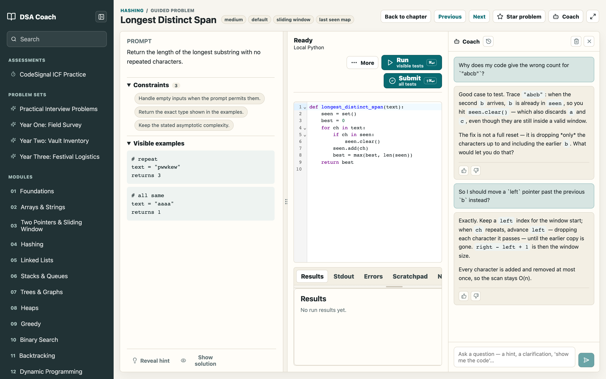
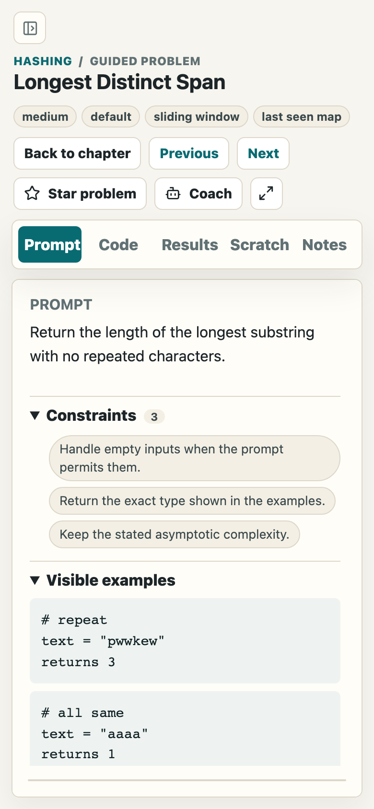
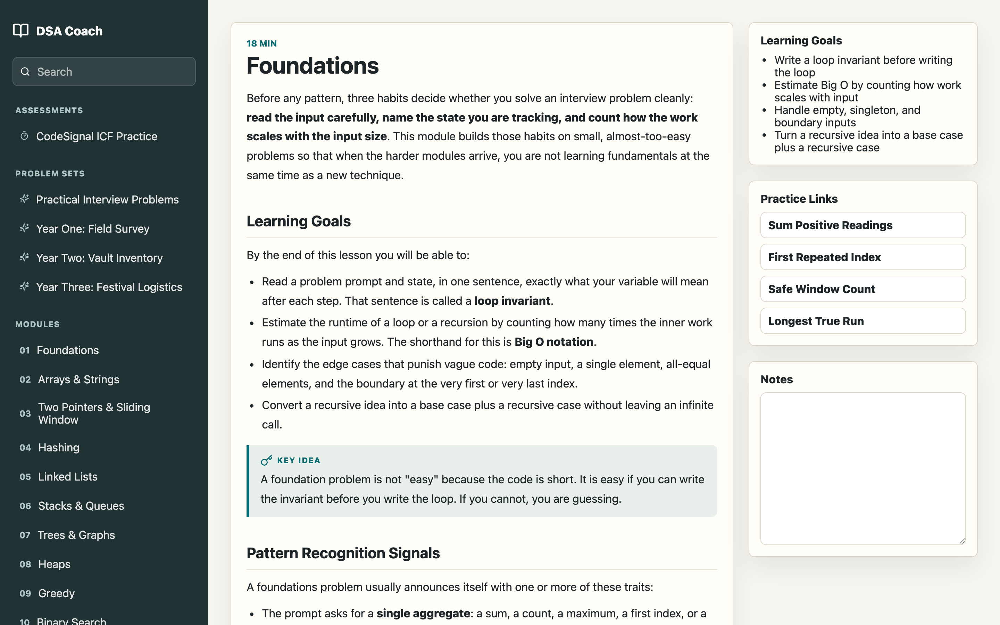
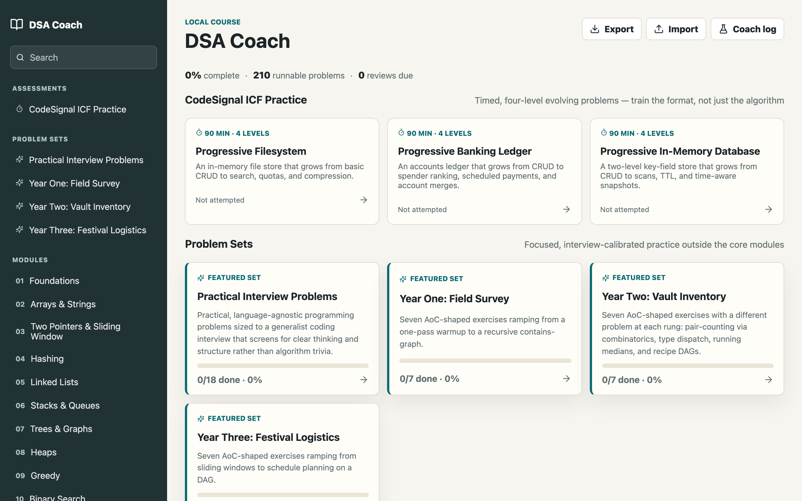

# DSA Coach

DSA Coach is a local-first, offline-capable course for practicing data structures, algorithms, and practical programming. It is a standalone React app with original lessons, quizzes, and runnable Python problems executed entirely in the browser via Pyodide — no server, no account, no network round-trips after the first load.

The project is built for serious self-study: read a lesson, work through guided problems, run Python locally in the editor, check your solution against visible *and* hidden tests, take quizzes, and — when you want a second pair of eyes — get unstuck with an optional local-LLM coach. It all runs offline; your progress lives in the browser and exports to JSON.



## Why it exists

Most practice tools are either online judges that hide the test cases, or static problem lists with no feedback loop. DSA Coach closes the loop locally:

- **Every reference solution is verified.** A build-time script runs all 256 reference solutions (plus 35 multi-part extensions) against their full visible + hidden test suites. A problem cannot ship if its own reference answer fails.
- **Hidden tests catch sloppy solutions.** Visible examples teach the contract; hidden tests probe the edge cases a rushed implementation gets wrong (off-by-one boundaries, mutation of inputs, tie-break order, parity, empty/degenerate inputs).
- **Practice that escalates.** Alongside the structured 13-module course there are interview sets, Advent-of-Code-style "years", and CodeSignal-style timed assessments — many built as multi-part problems where Part 2 extends your Part 1 design, mirroring how real interviews and exams ratchet up.

## Features

- **13 course modules** covering foundations, arrays, sliding windows, hashing, linked lists, stacks and queues, trees and graphs, heaps, greedy, binary search, backtracking, dynamic programming, and mixed review.
- **70 guided problems and 140 runnable bonus drills**, plus 12 quizzes with answer explanations.
- **7 problem sets (46 problems):** a practical generalist-interview set, three Advent-of-Code-style "years", a CodeSignal-style assessment track, and two Python standard-library drill sets — 29 of them carrying a runnable Part 2.
- **In-browser Python** through Pyodide in a Web Worker, with a 45-second execution timeout, a Stop button for runaway loops, and separate run / submit flows.
- **Type-aware autocomplete with signatures:** a Jedi-in-Pyodide language service (in its own worker) infers variable types — `position = []; position.` proposes `insert`, `append`, … with full call signatures and docs — backed by an instant builtin-container completer that covers the common case while Jedi warms up.
- **Optional local-LLM coach:** an openable side panel that coaches adaptively against a local model — Socratic by default, escalating only as far as you need, and willing to hand over the full solution if you ask for it outright. Fully opt-in and offline; the app works exactly the same without it.
- **Timed assessment mode:** the CodeSignal ICF practice track runs as a 90-minute exam — one problem, four escalating levels — with a live countdown and a per-level scorecard, or untimed when you just want to drill the format.
- **Problem workspace** with prompt, constraints, examples, CodeMirror editor, visible/hidden test results, stdout, errors, a scratchpad, notes, submission history, progressive hints, solutions, and an interview-discipline checklist on the problem sets.
- **IndexedDB persistence** for progress, notes, submissions, settings, spaced-review state, and per-problem (and per-part) workspace code.
- **JSON export/import** to move local progress between browsers.
- **Offline PWA** via a production service worker — the full app shell works without a network.
- **Responsive** down to mobile, with an accessible component layer audited with axe.

<p align="center">
  
  &nbsp;
  
</p>

## Practice tracks

The sidebar splits practice into four kinds:

**Modules** — the 13-module course. Each chapter pairs a long-form lesson (learning goals, pattern-recognition signals, mental models, worked examples, an implementation checklist, common mistakes, and complexity notes) with guided problems, runnable bonus drills, and a quiz.



**Problem sets** — calibrated practice that sits alongside the course:

| Set | Shape |
| --- | --- |
| Practical Interview Problems | 18 language-agnostic problems sized to a generalist coding interview; 5 extend into a Part 2 |
| Year One / Two / Three | 7 Advent-of-Code-style problems each — parse a messy text blob, compute Part 1, then a Part 2 that builds on it |

**Assessments** — *CodeSignal ICF Practice*: three evolving problems — a filesystem, a banking ledger, and an in-memory database — in the shape of a CodeSignal Industry Coding Framework exam. Each one grows across four levels under a single carry-forward solution, so an early data-model choice has to survive to Level 4. Run them as a timed 90-minute exam with a per-level scorecard, or untimed for practice.

**Libraries** — short drills on Python's batteries-included data structures: `sortedcontainers.SortedList` (running and sliding-window medians) and `collections.OrderedDict` (an LRU cache, a streaming first-unique). The point is fluency with the right tool, not reimplementing it.



## The coach (optional)

The coach is a side panel that talks to a local LLM. It is deliberately **not** a brick wall: it defaults to guidance and escalates along a fixed ladder driven by how many attempts you've made *and* what you actually ask for —

0. empty editor → orient: what to notice, which shape fits
1. first ask → one Socratic nudge
2. still stuck / a failing test → name the technique, point at the exact failing case, pseudocode skeleton
3. "show me the approach" → the full algorithm in prose
4. "just give me the code" / "I give up" / asked twice → the complete solution, plus a short *why it works / what to internalize*

It never refuses the same request twice and never nags. Every request is grounded in the problem's authored hints, walkthrough, and verified reference solution, so even a small local model stays correct and — at the last rung — hands over a vetted-consistent answer rather than an invented one. Each conversation is saved per problem; a history menu in the panel header reopens or continues any past session.

It is **opt-in and offline-first**. Nothing about the rest of the app depends on it; when the model isn't reachable the panel just explains how to start it.

```bash
ollama pull gemma4:latest
# allow the app's origin, then serve:
OLLAMA_ORIGINS="*" ollama serve
```

Open a problem, click **Coach**. If Ollama isn't running the panel degrades gracefully with the exact command to fix it.

## Quick Start

Prerequisite: [Bun](https://bun.sh/) 1.3.2 or newer.

```bash
bun install
bun run dev
```

Then open the URL printed by Vite, usually `http://127.0.0.1:5173`.

```bash
bun run build      # type-check then production build
bun run preview    # serve the production build locally
```

## Scripts

```bash
bun run dev                # Start Vite locally
bun run build              # Type-check and build
bun run preview            # Serve the production build locally
bun run test               # Unit tests (Vitest)
bun run test:e2e           # Playwright end-to-end tests
bun run test:a11y          # Playwright axe accessibility checks
bun run test:pwa           # Production offline / PWA checks
bun run validate:content   # Validate course and problem metadata against the schema
bun run verify:references  # Run every reference solution against its tests
```

## Project Structure

```text
src/components/   React screens and the problem workspace
src/content/      Course metadata, lessons, problems, quizzes, problem sets, and assessments
src/runner/       Pyodide test worker, Jedi intellisense worker, result comparison
src/coach/        Browser→Ollama client and the adaptive coaching prompts
src/storage/      Dexie / IndexedDB persistence
src/hooks/        Course store + React context
scripts/          Content validation and reference verification
tests/            Unit, E2E, accessibility, and PWA tests
ui-snapshots/     README screenshots
```

The interesting engineering lives in three places: the Pyodide-in-Worker runner with a normalized output comparator, the Zod-validated content pipeline whose every reference solution is executed and checked in CI-style gates, and the Jedi-backed completion service that brings IDE-grade Python autocomplete into a fully offline browser app.

## Content

All course content is original. Public topic coverage inspires the scope; no locked or paid lesson text, prompts, solutions, or templates are copied. The Advent-of-Code-style sets and the CodeSignal-style assessments are original problems written in the same shape as the formats they prepare you for — they are not copies of any published puzzle or exam.

Each problem ships with a prompt, constraints, worked examples, starter code, a verified reference solution, an alternate solution write-up, visible and hidden tests, progressive hints, a walkthrough, complexity notes, and follow-up ideas.

## Local Data

DSA Coach stores everything in browser IndexedDB — lesson/quiz/problem progress, submissions and run history, notes and scratchpad state, starred problems, spaced-review scheduling, assessment scorecards, coach conversations, and workspace layout. There is no account system and no cloud sync; use the built-in export/import controls to back up or move progress.

## Quality Gates

Before publishing a substantial content or UI change, the full gate is:

```bash
bun run validate:content
bun run verify:references
bun run test
bun run build
bun run test:e2e
bun run test:a11y
bun run test:pwa
```

`verify:references` is the load-bearing one: it executes every reference solution — including each multi-part Part 2 — against its complete test suite, so a regression in the content pipeline fails the build rather than reaching a learner.

## License

Released under the [MIT License](LICENSE).
